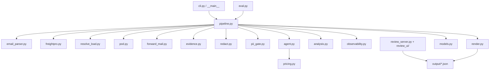
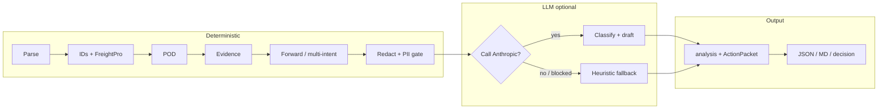
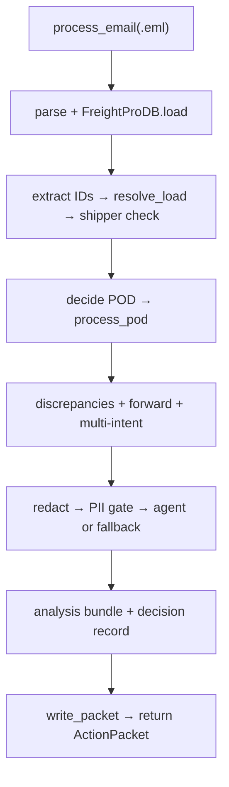
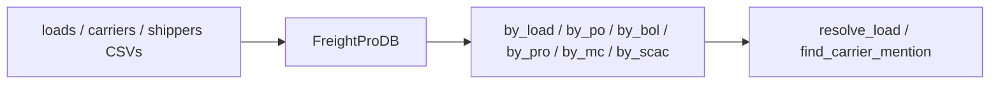
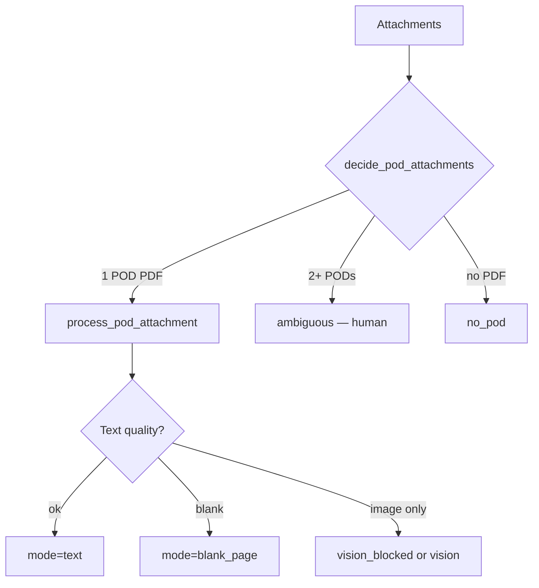
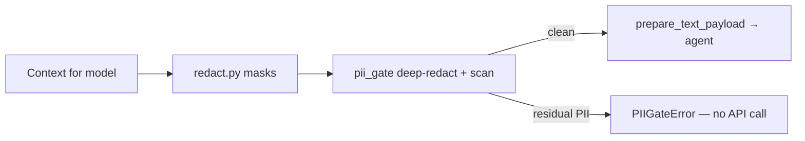
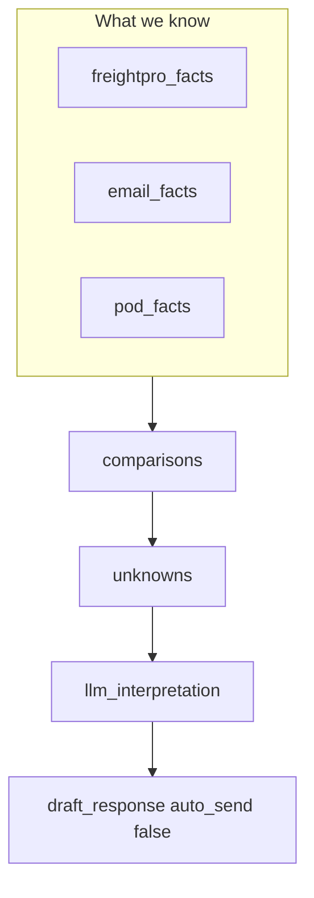
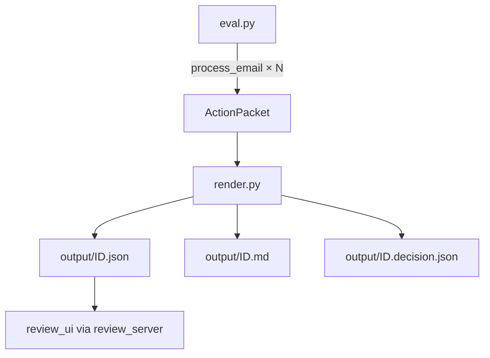

# Module guide — Meridian claims slice

Short map of every Python module: what it does, and how they connect.  
Client-facing design lives in [`DESIGN.md`](DESIGN.md).

---

## End-to-end flow

**Idea:** deterministic work first (parse → resolve → POD → compare → redact), then optional LLM, then a human-review packet. Nothing auto-sends.

---

## Pipeline stages (what runs for one email)

---

## Modules (one-liners + detail)

### Entry & orchestration

| Module | Role |
|---|---|
| `__main__.py` | `python -m meridian_claims` → calls CLI |
| `cli.py` | Commands: `process`, `eval`, `review` |
| `pipeline.py` | End-to-end conductor for one `.eml` |

**`pipeline.py`** wires every step, always sets `needs_human=True`, writes the packet. Dry-run skips Anthropic (`use_llm=False`).

---

### Data in

| Module | Role |
|---|---|
| `email_parser.py` | `.eml` → headers, body, attachments |
| `freightpro.py` | Read-only CSV snapshot: loads / carriers / shippers + indexes |

**`email_parser.py`** — RFC 822 parse; optional save of attachments under `output/attachments/<id>/`.

**`freightpro.py`** — In-memory DB. Indexes by MF / PO / BOL / PRO / MC / SCAC. Joins shipper+carrier on enrich. Does **not** load `rates.csv` or `carrier_availability.csv`.

---

### Resolve load & POD

| Module | Role |
|---|---|
| `resolve_load.py` | Extract MF/PO/BOL/PRO; look up load; sender↔shipper check |
| `pod.py` | Pick POD attachment; extract text / blank / vision-blocked |
| `forward_mail.py` | Detect forwards; fail-closed model policy |

**`resolve_load.py`** preference: LoadNumber → PO → BOL → PRO. Cross-checks other IDs. Multi-MF → ambiguous. Shipper corroboration: `matched` / `conflict` / `unavailable` (carrier mention never overturns LoadNumber).

**`pod.py`** — Deterministic selection (filename contains `pod`, or sole PDF). Multi-POD → escalate. Readable text → `mode=text`; blank scan → `blank_page`; vision off by default.

---

### Evidence & safety

| Module | Role |
|---|---|
| `evidence.py` | Deterministic discrepancies + draft sanitize |
| `redact.py` | Pattern-mask phones, emails, driver/receiver labels |
| `pii_gate.py` | Last check before Anthropic; block residual PII; vision default off |

**`evidence.py`** — e.g. damage email vs clean POD; POD IDs vs load; equipment mismatch; strip liability language; block invented `$` amounts.

**`redact.py` → `pii_gate.py`**

---

### Model & analysis

| Module | Role |
|---|---|
| `agent.py` | Anthropic classify + draft; JSON parse; usage |
| `analysis.py` | Separate freightpro / email / pod / comparisons / unknowns / AI / draft |
| `pricing.py` | Estimated $ from tokens × env rates |

**`agent.py`** — Requires `ANTHROPIC_API_KEY`. System prompt: don’t invent facts, don’t approve/deny claims. Returns JSON interpretation fields.

**`analysis.py`** — Filing cabinet for the packet:

Also scrub invented MF/PO/BOL from model prose via `validate_llm_against_known_facts`.

---

### Output, audit, eval, UI

| Module | Role |
|---|---|
| `models.py` | Dataclasses: `ActionPacket`, `Resolution`, `PodResult`, … → `to_dict()` |
| `render.py` | Write `*.json`, `*.md`, `*.decision.json`; CLI summary |
| `observability.py` | PII-safe decision/audit record |
| `eval.py` | 8-claim fixture regression + optional all-60 behavioral run |
| `review_server.py` | Local HTTP server for review UI |
| `review_ui/` | Static HTML/JS/CSS over `output/*.json` (no send) |

**`eval.py`**
- Default: 8 `claims@` emails vs `EXPECTED_LOADS` → known-sample **8/8** regression (not production accuracy).
- `--all`: all 60 sample emails behavioral run.

**`review_server.py` + `review_ui/`** — `python -m meridian_claims review` → browse packets at `127.0.0.1:8765`. Read-only; never emails or calls models.

---

## Data this slice uses

| Path | Used? |
|---|---|
| `data/emails/*.eml` | Yes |
| `data/attachments/*.pdf` (PODs) | Yes |
| `data/freightpro/loads.csv` | Yes |
| `data/freightpro/carriers.csv` | Yes |
| `data/freightpro/shippers.csv` | Yes |
| `data/freightpro/rates.csv` | No (quotes) |
| `data/carrier_availability.csv` | No (dispatch) |
| `data/attachments/*.xls` | Inventoried only, not parsed |

---

## Quick “who owns what”

| Concern | Module(s) |
|---|---|
| CLI | `cli.py` |
| Orchestration | `pipeline.py` |
| Email bytes → fields | `email_parser.py` |
| TMS snapshot | `freightpro.py` |
| Which load? | `resolve_load.py` |
| Which POD / can we read it? | `pod.py` |
| Conflicts + safe draft | `evidence.py` |
| Forwards | `forward_mail.py` |
| Mask PII | `redact.py` |
| Block dirty payloads | `pii_gate.py` |
| Call Claude | `agent.py` |
| Fact buckets | `analysis.py` |
| Schema | `models.py` |
| Write files | `render.py` |
| Audit + $ | `observability.py`, `pricing.py` |
| Regression / all-60 | `eval.py` |
| Local review UI | `review_server.py`, `review_ui/` |
