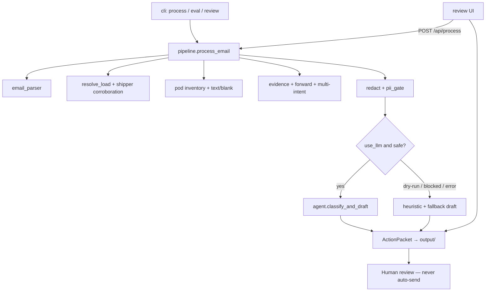

# Technical handoff — Meridian Freight claims triage

Status labels: **EXISTS** / **PARTIAL** / **FRAGILE** / **MISSING** (intentional).  
Aligned with current `meridian_claims/` code. Client plan: [`DESIGN.md`](DESIGN.md). Module map: [`MODULES.md`](MODULES.md).

---

## 1. Repository structure

```text
├── README.md / DESIGN.md / NOTES.md / INSTRUCTIONS.md / data.md
├── TECHNICAL_HANDOFF.md / MODULES.md
├── requirements.txt · .env.example · .gitignore
├── data/          emails, attachments, freightpro CSVs, carrier_availability
├── meridian_claims/
├── tests/
└── output/        gitignored runtime packets
```

| Module | Role |
|---|---|
| `cli.py` | `process` / `eval` / `review` |
| `pipeline.py` | End-to-end `process_email()` |
| `email_parser.py` | `.eml` → headers, body, attachments |
| `resolve_load.py` | MF/PO/BOL/PRO + shipper corroboration |
| `freightpro.py` | Read-only CSV snapshot + indexes |
| `pod.py` | Attachment inventory, PDF text / blank / gated vision |
| `forward_mail.py` | Forward markers → model fail-closed |
| `evidence.py` | Discrepancies + draft $/liability sanitize |
| `redact.py` / `pii_gate.py` | Mask + outbound residual scan |
| `agent.py` | Anthropic classify+draft (+ request-scoped API key override) |
| `analysis.py` / `observability.py` / `pricing.py` | Fact buckets, decision audit, estimated $ |
| `eval.py` | 8-fixture regression + optional all-sample behavioral |
| `review_server.py` + `review_ui/` | Local review UI; optional live re-process; no send |
| `models.py` / `render.py` | Packet schema + JSON/MD writers |

**UNUSED (by design):** `rates.csv`, `carrier_availability.csv`.

---

## 2. Architecture



**Orchestration:** synchronous in `process_email()`. No Graph, no queue, no FreightPro writes.  
**MISSING (intentional):** production mail ingress/egress, auto-send.

---

## 3. Walkthrough: `035.eml`

1. Parse → From prairiegraincooper, MF-10487 / BOL / PO, POD PDF  
2. Resolve unique LoadNumber → Prairie Grain + JB Hunt; shipper corroboration **matched**  
3. POD text readable (“no exceptions”) → `mode=text`  
4. Deterministic **damage vs clean POD** discrepancies  
5. Redact → optional Anthropic (or dry-run heuristic draft)  
6. Write `output/035.{json,md,decision.json}` with `needs_human=True`, `auto_send=false`

Also demo: `036` blank POD · `041` PO resolve · `058` forward + multi-MF fail-closed.

---

## 4. LLM

| Call | Where | When |
|---|---|---|
| Classify + draft | `agent.classify_and_draft` | Live process (not dry-run), after PII gate |
| POD vision | `pod._vision_pod` | Only if no text, not blank, **and** `MERIDIAN_ALLOW_POD_VISION=1` |

- Model: `ANTHROPIC_MODEL` or `claude-sonnet-4-5-20250929`  
- Key: env / `.env`, or review-UI override via `temporary_api_key` (never stored on packet)  
- Validation: JSON parse, invented ID scrub, draft sanitize; failures → deterministic fallback  

---

## 5. Data / resolve

Order: **LoadNumber → PO → BOL → PRO**. Unique → `resolved`; conflicts / multi-MF → `ambiguous`.  
Shipper corroboration: `matched` / `conflict` / `unavailable` (**EXISTS**).  
Carrier: prefer SCAC/MC; free-text mention is informational and does not overturn LoadNumber (**FRAGILE** on substrings).  
Automation gate: only `resolution.status == "resolved"` is authoritative for future action.

---

## 6. POD

- Inventory all attachments; select POD-named PDF or sole PDF  
- Multi-POD → escalate, no silent pick (**EXISTS**)  
- Text ≥ quality threshold → `text`; blank scan → `blank_page`; else vision_blocked by default  
- Non-PDF inventoried, not parsed (**PARTIAL**)

---

## 7. PII

**EXISTS:** FreightPro DriverName/Phone lexicon · pattern redact · outbound residual scan fail-closed · rates stripped from model load · forwards fail-closed when third-party PII not guaranteed · model sees `sender_corroboration`, not raw From/To.

**PARTIAL:** unlabeled personal names not in lexicon; coordinator JSON still shows From for HITL; vision pixels unsafe if ever enabled.

**Mitigation ≠ DPA.**

---

## 8. Human review

- `needs_human` always true on claims path  
- CLI packets + local **review UI** (`python -m meridian_claims review`)  
- UI can list packets, show latency/tokens, **re-run pipeline** (LLM default; dry-run optional; UI or env API key)  
- Accept/Reject → browser `localStorage` only  
- **Auto-send: MISSING** (correct) — nothing is emailed

---

## 9. Tests + eval

- Unit tests (`pytest -q`): resolve, redact, PII boundary (mocked Anthropic), forwards, multi-intent, observability, analysis layout, review helpers, cost fields (~94 tests)  
- `eval --dry-run`: 8 `EXPECTED_LOADS` fixtures — **known-sample regression, not production accuracy**  
- `eval --all`: every file in `data/emails/` — behavioral (crash/HITL), not accuracy  

---

## 10. Failure matrix (current behavior)

| Case | Behavior |
|---|---|
| No MF | Fall through PO/BOL/PRO |
| Conflicting IDs / multi-MF | `ambiguous` + conflicts |
| Sender domain ≠ shipper | corroboration `conflict` → ambiguous path |
| Blank / vision-blocked POD | escalate; no invented POD facts |
| Damage email vs clean POD | deterministic discrepancies (035) |
| Forward + driver phone | model fail-closed; human packet kept |
| Claims + tracking/invoice/quote | multi-intent escalate; secondary not executed |
| Anthropic down / bad JSON | fallback draft, `llm_status=error` |
| Invented $ / liability language | draft sanitize |
| Missing API key (live) | clear fail (exit 2 / UI error) |

---

## 11. Docs vs code

| Doc | Match? |
|---|---|
| README / DESIGN / NOTES / MODULES / TECHNICAL_HANDOFF | Match current slice (live review re-process, all-sample eval) |
| Weeks 3–6 Graph / production queue | Roadmap only — **MISSING** in code (intentional) |

---

## 12. Honest residual risks

1. Unique MF ≠ guaranteed correct shipper if corroboration unavailable  
2. OCR threshold can mis-label noisy text as readable (**FRAGILE**)  
3. Carrier free-text matching brittle  
4. Dry-run does not exercise live residual PII gate  
5. Eval 8/8 easy to oversell — call it fixture regression  
6. CSV reload per email — demo-grade  

---

## FINAL HANDOFF

- **Architecture:** Deterministic first, LLM second, HITL always, no send / no TMS write  
- **Strongest:** Claims scope; 035 contradiction; blank POD honesty; shipper corroboration; forward/multi-intent gates; PII fail-closed tests; analysis separation  
- **Weakest:** Demo-scale data access; OCR edge cases; stretch breadth vs “pick one” (owned in NOTES)  
- **Demo:**

```bash
python3 -m venv .venv && source .venv/bin/activate && pip install -r requirements.txt
export ANTHROPIC_API_KEY=...   # or .env
python -m meridian_claims process data/emails/035.eml
python -m meridian_claims process data/emails/035.eml --dry-run
python -m meridian_claims eval --dry-run
pytest -q
python -m meridian_claims review
```
